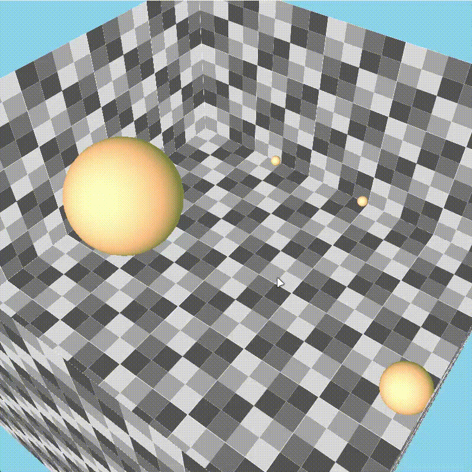

# Particles-Simulator

This is my personal 3D particles simulator that uses OpenGL and C++. It is a project that I started to learn OpenGL but also to learn more about particles simulation using the Verlet integration.



## How to use

First install all the included libraries (glew, stb, glm, glfw). (I will try to make this step easier in the future)

This project was developed using MSVC and CMake. To compile it, you need to have CMake installed and a C++ compiler that supports C++17. You can use the following commands to compile the project:

```bash
mkdir bin
mkdir build
cd build
cmake ..
cmake --build . 
cmake --build . --target clean # to clean the build
```

If you are not using a Windows machine, it is possible that you encounter some problems with the libraries or other stuff. For the moment i am not working on a compatibility version for Linux or MacOS.

## More details

...

## Author

- [ALXS](https://github.com/ALXS-GitHub)